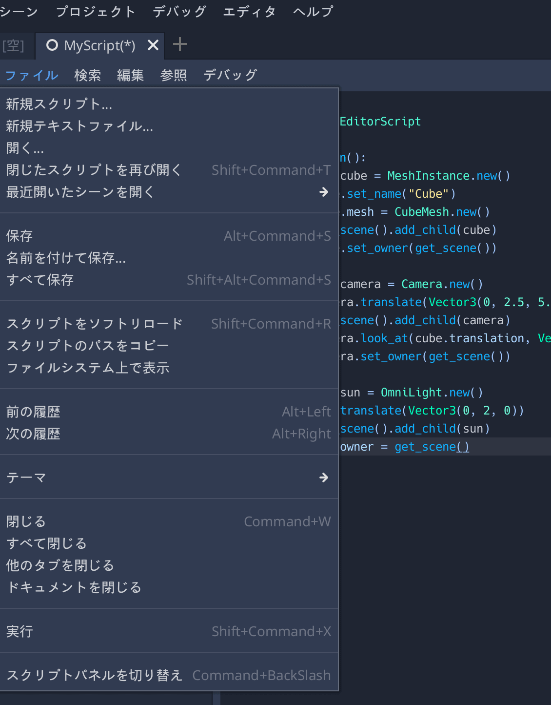

= Tool Mode Tutorial

== 参考動画

https://www.youtube.com/watch?v=XPs-HGzElTg

== tool
GDScriptの先頭に、 [red]#tool# とつけたら +
エディター上でもプログラムが動作する

* _ready()
* _process()
* _physics_process()

などなど、一般的なライフサイクル関数を実行するのもいいが、 +
特に、

* export変数 + setget関数
* signal

と相性がいい

== ex1. ResetToZero.gd

[source,gdscript]
----
include::../Scenes/ResetToZero/ResetToZero.gd[]
----

ポイント

* 先頭に tool
* export(bool)変数にsetget関数を設定し、エディター上のインスペクターから値を変更することで起動
* `Engine.is_editor_hint()`
** エディター上でだけ `true` を返す
** 実行時にはこのsetgetをしても意味がないようにする。

== ex2. GDScriptMacro.gd

SceneTreeに対して、複数のNodeを定型的にインスタンス化して追加したり、 +
Treeに存在するオブジェクトを取得 & プロパティを操作したりと行った +
[red]#Macro# 的な操作を実行する

[source,gdscript,attributes]
----
include::../Scenes/GDScriptMacro/MyScript.gd[]
----

ポイント
* tool
* [red]#_run()#メソッドを定義
** スクリプトエディタから ファイル > 実行 する。
** すると、マクロな操作を実行し、結果がエディタ上の編集として残る

