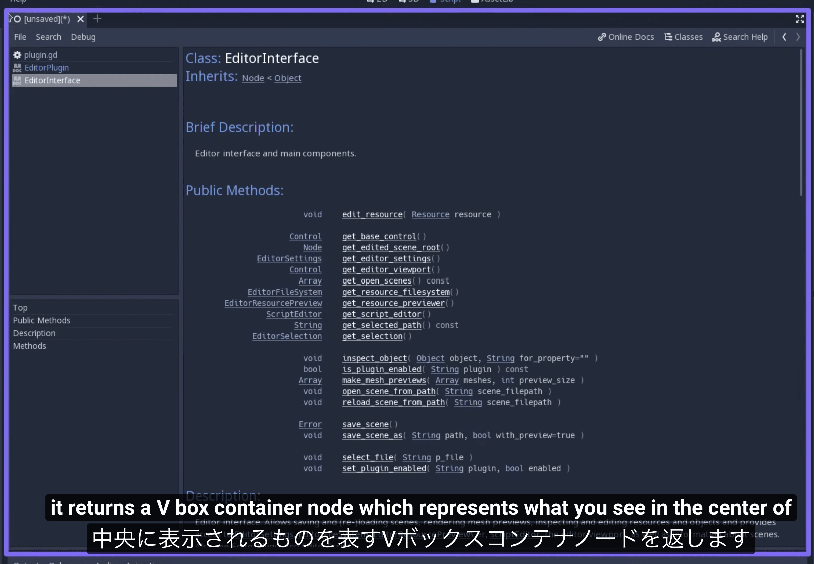

= IntroToPluginPart1

== 参考ビデオ

https://www.youtube.com/watch?v=kSC_m9yy9w0

== Godot Plugin の概要

必ず、 [red]#res://addons/# の直下に、 +
一つのフォルダにまとめられる

.最小要素
* {Plugin}.gd
* {Plugin}.cfg

== .cfg ファイル

Godot Engine に Plugin の存在を知らせるための設定ファイル。 +
プラグインに関する情報を書く

Godotのリソースの書き方 +
Tomlっぽい

重要なフィールド

* name : Project Settings > Plugins に表示される名前
* script : 初期化スクリプトとして呼び出されるスクリプト。
** 2種類の書き方
*** pluginディレクトリからの相対パス
*** [red]#res://# の絶対パス

== EditorPlugin class

Godot Editor の様々な機能にアクセスする

* ボタンを追加
* メニューを追加
* #Control# Node を様々な場所に追加する

最も強力な機能は、 [red]#get_editor_interface()# +
EditorInterface ノードを返す

.様々なEnumももつ
* CustomControlContainer
** Godot Editor を構築する Control Node (UI要素)の場所を指すid
* DockSlot
** Inspector, Node, Scene などのタブを入れるDock のid

=== EditorPlugin のシグナル

* `main_screen_changed(string screen_name)`
** 2D, 3D, Script, AssetLib とか
* `scene_changed(Object scene_root)`
* `scene_closed(String filepath)`

=== EditorInterface Node

Godot Editor の重要で便利な要素にアクセスできる

* `get_base_control() -> Control`
** 表示されているすべてのモノへのアクセスを提供する
* `get_edited_scene_root() -> Node`
** 編集しているシーンの root ノードを取得する。
* `get_editor_viewport() -> Control`
** 中央に表示されてるUIのVBoxContainerを返す。(Viewport ではない)
* `get_selection() -> EditorSelection`
** Godot Editor 上で選択されているものを返す(いろいろある)
*** ヒエラルキー上のNode
*** Script Editor で編集しているファイル

